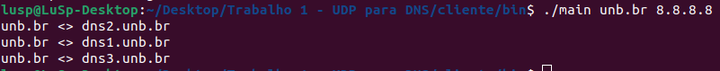
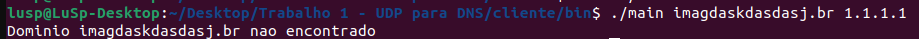
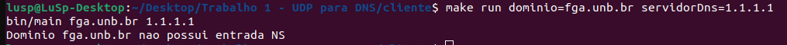
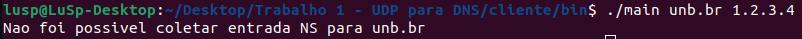

# Trabalho 01: Cliente DNS

Para o trabalho 01, a equipe construiu um cliente DNS de domínio autoritativo em linguagem C.

## Membros
Alex Gabriel Alves Faustino - 200056603  
Levi de Oliveira Queiroz - 170108341  
Lucas de Lima Spinosa dos Santos - 180022512  
Nicolas Roberto de Queiroz - 200042360  

## Sistema Operacional Utilizado no Desenvolvimento

Todos os membros utilizaram Linux, sendo a distribuição o Ubuntu. 

## Ambiente de Desenvolvimento Utilizado no Desenvolvimento

Os membros utilizaram a IDE Visual Studio Code.

# Como Construir a Aplicação

Antes de executar os comandos abaixo, certifique-se de ter o GCC, Make e CMake instalados no seu sistema.

Abaixo estão comandos (para Linux) de instalação dessas dependências.

```console
sudo apt install gcc 
```
```console
sudo apt install make
```
```console
sudo apt install cmake
```

Com as dependências instaladas, entre na pasta ```cliente``` e execute o seguinte comando:

```console
make all  
```
# Como Executar a Aplicação

Uma vez que o comando ```make all``` foi executado conforme instruído acima, pode-se executar a aplicação usando ```make``` ou executando o arquivo binário diretamente pelo terminal.

A seguir serão mostradas ambas as opções:

## Execução com Make

Na pasta ```cliente```, execute o comando a seguir:

```console
make run dominio=<nome_do_dominio> servidorDns=<ip_servidor_dns>
```

Lembre-se de substituir ```<nome_do_dominio>``` e ```<ip_servidor_dns>``` pelos valores que deseja consultar.

Por exemplo, supondo que eu queira consultar o domínio ```amazon.com``` no servidor DNS ```1.1.1.1```, esse seria o comando: 
```console
make run dominio=amazon.com servidorDns=1.1.1.1
```

Caso seja executado apenas ```make run```, tanto o domínio quanto o servidor DNS assumiram os valores padrão: ```unb.br``` e ```8.8.8.8```.

## Executando o Arquivo Binário pelo Terminal

A outra maneira seria execurar o arquivo binário gerado pelo Make diretamente pelo terminal.

Para isso, vá até a pasta ```bin``` e execute esse comando:

```console
./main <nome_do_dominio> <ip_servidor_dns>
```

Lembre-se de substituir ```<nome_do_dominio>``` e ```<ip_servidor_dns>``` pelos valores que deseja consultar.

Por exemplo, supondo que eu queira consultar o domínio ```amazon.com``` no servidor DNS ```1.1.1.1```, esse seria o comando: 

```console
./main amazon.com 1.1.1.1
```

## Telas da Aplicação

### Resolução Bem Sucedida




### Resolução com Falha: Nome de Domínio Não Existe



### Resolução com Falha: Domínio Não Possui Entrada NS



### Resolução com Falha: Servidor Não Existe/Não Atendeu



## Limitações Conhecidas 

Não foram encontradas limitações pela equipe. O programa atende o que foi pedido pelo professor.